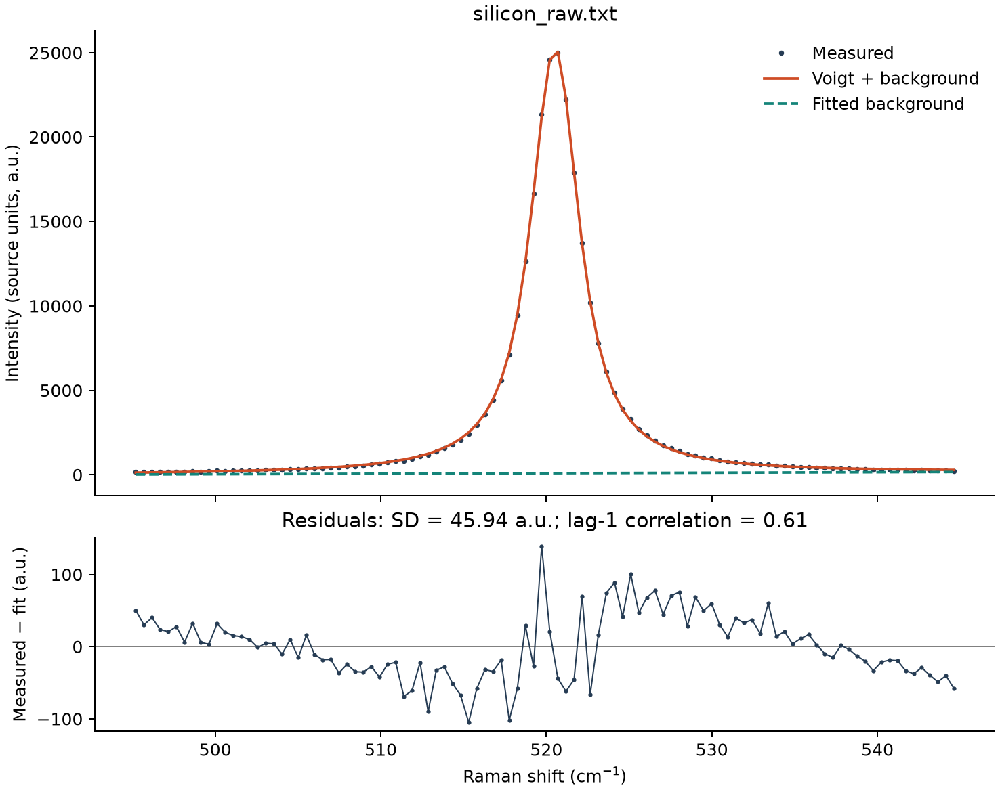
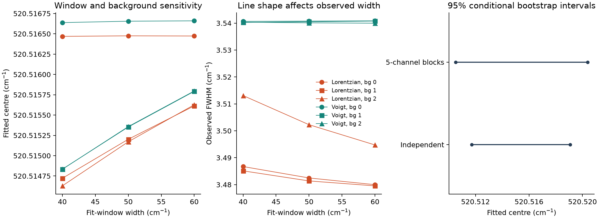

# Raman Spectroscopy Analysis with Uncertainty

[](https://github.com/Atabrahim/semiconductor-raman-analysis/actions/workflows/ci.yml)

Analyse an experimental silicon Raman band with joint peak/background fitting, explicit quality flags and uncertainty that remains separate from model sensitivity.



**Measured case:** silicon wafer, 532 nm excitation, Kauffmann / LMOPS (2021), [DOI:10.12763/VUVLSZ](https://doi.org/10.12763/VUVLSZ), CC0-1.0. Points are experimental intensities; curves and background are fitted quantities. Residuals are measured minus fitted intensity. No smoothing or spike removal is applied in this case.

**First-release scope complete (v0.1.0).** 62 tests pass; built-wheel installation, documented commands and four CI jobs are verified. [Release checks](docs/RELEASE_CHECKS.md) · [Development record](docs/PROJECT_PROGRESS.md).

## Why this project exists

A visually convincing Raman fit can conceal correlated residuals, background dependence and calibration uncertainty. This project asks which estimates survive reasonable analysis choices, rather than turning one precise peak shift into an unsupported strain or doping measurement.

It complements carrier-statistics and PN-junction simulations with experimental data provenance, nonlinear inverse modelling, uncertainty estimation and batch quality control.

## What it does

- Validates two-column shift/intensity files; audits reversed axes and explicit invalid-row removal.
- Fits one isolated positive band with a Lorentzian or Voigt profile and a simultaneous constant, linear or quadratic background.
- Reports centre, observed FWHM, integrated area, peak height, shape widths and background coefficients.
- Flags candidate spikes, weak/underresolved peaks, bound hits, rank deficiency and correlated residuals. Candidate spikes remain in the data unless exclusion is explicitly requested.
- Provides local covariance errors and reproducible independent/block residual-bootstrap intervals, including failed-refit counts.
- Compares AICc only on identical observations; reports window/background sensitivity separately.
- Exports batch CSV/JSON reports, per-observation fits/residuals and bootstrap samples through a Python API and CLI.

## Measured results and interpretation

Default fit: 495–545 cm⁻¹ window, centre bounds 510–530 cm⁻¹, Voigt plus linear background. The supplied shift axis is used unchanged.

| Quantity | Model-derived result |
|---|---:|
| Centre | 520.515 cm⁻¹ |
| Observed FWHM | 3.541 cm⁻¹ |
| Integrated area | 136,760 source-intensity units × cm⁻¹ |
| Background-free peak height | 25,183 source-intensity units |
| Lag-1 residual correlation | 0.607 |
| Centre, independent-residual 95% interval | 520.5117–520.5191 cm⁻¹ |
| Centre, 5-channel-block 95% interval | 520.5105–520.5204 cm⁻¹ |

Intervals use 200 refits and seed 2026. Extra digits distinguish numerical results; they do **not** establish absolute experimental accuracy. Calibration uncertainty, instrumental broadening and model bias are not included. The sampled maximum (520.694 cm⁻¹) is a different quantity from the fitted centre.



Left/middle: 18 declared choices (two line shapes, three backgrounds, three windows). `bg` is polynomial degree. Axes are enlarged to show small differences, not a claim of metrological precision. Right: conditional intervals for the default fit. Lorentzian and Voigt widths differ even when centres are similar. **The structured residuals remain a model limitation.** See [scientific model](docs/MODEL.md) and [validation](docs/VALIDATION.md).

## Installation

Python 3.11–3.13. From a terminal with Git and Python installed (Linux/macOS):

```bash
git clone https://github.com/Atabrahim/semiconductor-raman-analysis.git
cd semiconductor-raman-analysis
python -m venv .venv
source .venv/bin/activate
python -m pip install ".[plots]"
```

The package is installed from this repository; no PyPI publication is claimed. The `plots` extra adds Matplotlib. Core numerical work uses NumPy, SciPy and pandas. The raw case-study data live in the repository/source distribution, not inside the wheel.

## Usage

Run the measured case with provenance and explicit configuration:

```bash
raman-analyze data/silicon_raw.txt --config examples/silicon.json --metadata data/provenance.json --output outputs/silicon --bootstrap 200 --block-size 5 --plots
```

`python -m raman_analysis` is equivalent to `raman-analyze`. Multiple input paths produce a batch report. A failed input remains an explicit row and gives CLI exit code 1; quality warnings remain visible but give exit code 0. Use a new output directory on each run: existing reports are protected against accidental overwrite. A malformed command/configuration gives exit code 2.

Public Python API:

```python
from raman_analysis import read_spectrum, fit_peak, bootstrap_fit

spectrum = read_spectrum("data/silicon_raw.txt")
fit = fit_peak(spectrum, model="voigt", baseline_degree=1)
uncertainty = bootstrap_fit(fit, n_resamples=200, block_size=5, seed=2026)
print(f"Centre: {fit.center_cm1:.3f} cm^-1; FWHM: {fit.fwhm_cm1:.3f} cm^-1")
print(fit.flags)
print(uncertainty.intervals["center_cm1"])
```

Reproduce the complete case study, sensitivity tables, figures, synthetic batch and 100-trial validation:

```bash
python examples/reproduce.py --output outputs/case-study
```

The experimental collection contains **one spectrum**. The three batch demonstration files are explicitly synthetic, with known generating parameters; they are not additional experiments. [Committed reference reports](reports/README.md) record representative outputs. Reproduction compares numerical quantities within tolerance, not PNG byte identity across platforms.

## Physics and numerical methods

Stokes Raman shift is the difference between incident and scattered photon wavenumbers (cm⁻¹). This release analyses the first-order silicon optical-phonon band. Its symmetric Lorentzian model is

$$L(s)=\frac{A\gamma}{\pi[(s-s_0)^2+\gamma^2]},$$

where $s$ and centre $s_0$ are in cm⁻¹, $\gamma$ is the half width at half maximum in cm⁻¹, and $A$ is integrated area in intensity × cm⁻¹. A Voigt profile convolves this line with a Gaussian of standard deviation $\sigma$ (cm⁻¹). Background coefficients multiply a dimensionless centred/scaled shift coordinate.

Bounded trust-region least squares fits peak and background together. Log area/widths enforce positivity; scaling and two Voigt initializations improve conditioning. SVD yields conditional local covariance. Brent's method locates the Voigt half-height crossing. Residual bootstrap refits artificial spectra; block resampling tests sensitivity to local residual correlation. [Equations, conventions and assumptions](docs/MODEL.md).

## Validation and quality checks

- Independent quadrature checks the Voigt convolution; analytical tests cover Gaussian/Lorentzian limits and area normalization.
- Independent synthetic formulas verify parameter recovery, unit scaling and curved-background treatment.
- Bootstrap tests check fixed-seed reproducibility, all reported quantities, failure accounting, fixed masks and correlated-noise sensitivity.
- Tests prohibit misleading AICc comparisons across different windows.
- Batch/CLI tests cover failed inputs, duplicate names, output protection, report auditing and plotting.
- A 100-trial synthetic Gaussian-noise study gives centre RMSE 0.00397 cm⁻¹ and local-interval coverage 92/100 (Monte Carlo SE 0.027). This verifies behaviour under declared assumptions, not experimental absolute accuracy.

**62 tests passed, 0 failed, 0 skipped** in the final clean-install checks. GitHub Actions verifies Linux Python 3.11, 3.12 and 3.13 and Windows Python 3.12. [Release-check evidence](docs/RELEASE_CHECKS.md).

To run the development checks and build source/wheel distributions:

```bash
python -m pip install ".[dev]"
python -m pytest -q
python -m ruff check .
python -m ruff format --check .
python -m build
```

## Structure

| Path | Purpose |
|---|---|
| `src/raman_analysis/` | Import/QC, models, fitting, uncertainty, comparison, workflow, CLI and optional plotting |
| `tests/` | Scientific and software behaviour checks |
| `data/` | Byte-identical CC0 measurement, source README and provenance |
| `examples/` | Declared silicon configuration and reproducible case study |
| `reports/`, `figures/` | Reviewed representative outputs and their interpretation |
| `docs/` | Scientific model, validation, progress, release checks and learning notes |

## Assumptions, limitations and future work

One isolated, approximately symmetric band; locally smooth polynomial background; positive peak; fixed measured shift axis. Equal-variance Gaussian errors are a working likelihood. Residual resampling further assumes an adequate mean model and, for blocks, local stationarity. The measured residuals challenge these assumptions; flags and sensitivity remain part of the result.

There is no independently certified peak position, measured instrument response, repeated acquisition or spatial coordinate set in the dataset. No unique strain, doping, temperature, phonon lifetime or spatial map is reported. AICc is a conditional ranking, not proof of a physical mechanism. Spike detection is a screening heuristic, and can miss artefacts or flag real narrow structure. No smoothing is hidden in the pipeline.

Future extensions require supporting measurements: calibrated response deconvolution, repeated-acquisition uncertainty, detector-noise weighting, and asymmetric/overlapping-band models. They are outside this release.

## Data, references and attribution

- Kauffmann, T. H. (2021), *Raman spectrum of silicon sample from 50 to 4000 cm-1*, LMOPS / Université de Lorraine, version 1.0, [10.12763/VUVLSZ](https://doi.org/10.12763/VUVLSZ). CC0-1.0; conditions and hashes in [data provenance](data/README.md).
- [SciPy Voigt profile](https://docs.scipy.org/doc/scipy/reference/generated/scipy.special.voigt_profile.html) and [bounded least squares](https://docs.scipy.org/doc/scipy/reference/generated/scipy.optimize.least_squares.html).
- H. R. Künsch (1989), *The jackknife and the bootstrap for general stationary observations*, Annals of Statistics 17, 1217–1241. [Author's publication record](https://people.math.ethz.ch/~kuensch/papers/).
- [HORIBA Raman spectroscopy](https://www.horiba.com/int/scientific/technologies/raman-imaging-and-spectroscopy/raman-spectroscopy/).

The original nanowire archive contained transport/SEM files but no Raman data; its verified rejection is preserved in the progress record. This release uses the silicon wafer measurement above.

Original software: [MIT licence](LICENSE), enabling reuse with attribution. External data: CC0-1.0. Development, documentation and checks were performed with AI assistance. The experimental work belongs to the cited authors; repository ownership alone does not establish independent implementation, reproduction or mastery. [Learning and interview notes](docs/LEARNING_NOTES.md).
